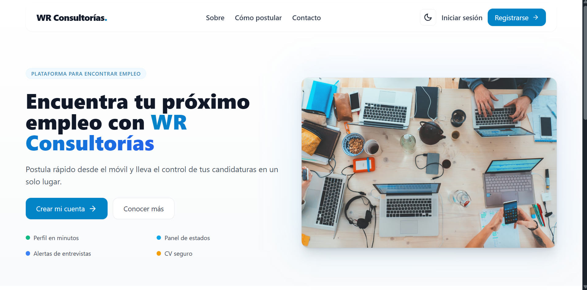
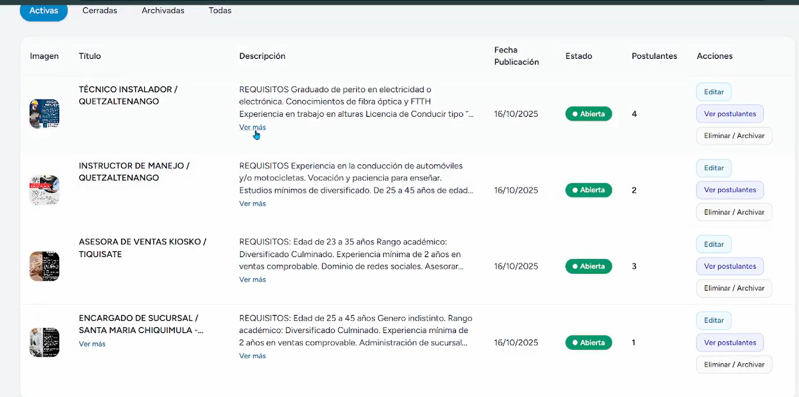
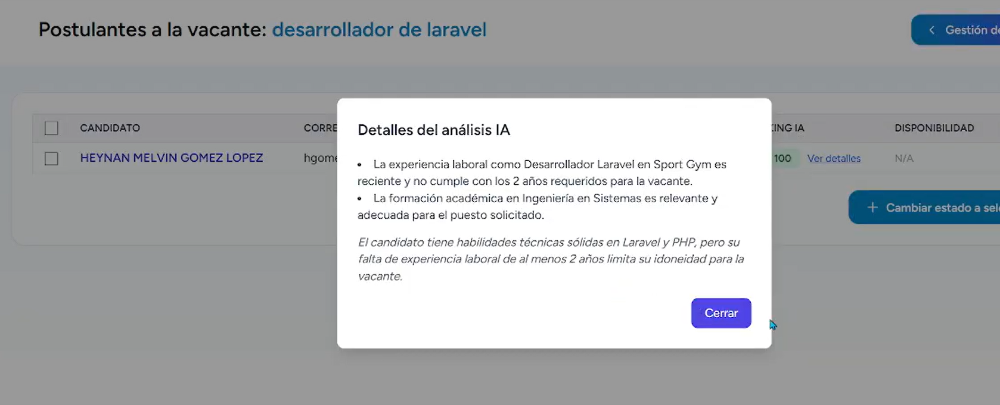
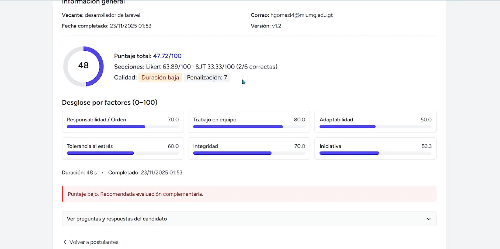

# WR Reclutamiento

Plataforma web de reclutamiento desarrollada para digitalizar y optimizar procesos de selección de personal.  
El sistema permite publicar vacantes, recibir postulaciones, gestionar candidatos, analizar CVs con Inteligencia Artificial, aplicar pruebas psicométricas y dar seguimiento completo al proceso de contratación.

---

## Vista general del proyecto

WR Reclutamiento es una aplicación web orientada a consultoras de recursos humanos, empresas de reclutamiento o departamentos internos de talento humano que necesitan centralizar sus procesos de selección.

El proyecto permite administrar el ciclo completo de reclutamiento, desde la creación de una vacante hasta la contratación o cierre del proceso.

Entre sus funciones principales se incluyen:

- Publicación y administración de vacantes.
- Registro de candidatos.
- Postulación a ofertas laborales.
- Carga y almacenamiento seguro de CVs.
- Análisis de CVs con Inteligencia Artificial.
- Ranking automático de candidatos.
- Gestión de entrevistas.
- Prueba psicométrica interna.
- Seguimiento por estados del proceso.
- Notificaciones automáticas.
- Reportes administrativos y métricas.

---

## Demo del proyecto

Puedes ver una demostración del funcionamiento del sistema en el siguiente enlace:

[Ver video demostrativo en Google Drive](COLOCA_AQUI_EL_LINK_DE_TU_VIDEO)

---

## Capturas del proyecto

> En esta sección se pueden colocar imágenes del panel administrativo, pantalla de vacantes, postulación, ranking IA, psicotest y reportes.

### Panel principal



### Gestión de vacantes



### Postulaciones y candidatos


### Ranking con Inteligencia Artificial



### Módulo psicométrico



### Reportes administrativos


---

## Objetivo

El objetivo principal del proyecto es construir una solución funcional y escalable para gestionar procesos de reclutamiento de manera más eficiente.

La plataforma busca reducir tareas manuales, mejorar el seguimiento de candidatos y apoyar la toma de decisiones mediante reportes, automatización e Inteligencia Artificial aplicada al análisis de CVs.

---

## Tecnologías utilizadas

### Backend

- Laravel 10
- PHP 8
- MySQL
- Laravel Queues
- Laravel Notifications
- Laravel Excel

### Frontend

- Blade
- Tailwind CSS
- JavaScript
- Chart.js

### Almacenamiento

- Supabase Storage
- Bucket privado para CVs
- Bucket público para imágenes de vacantes

### Inteligencia Artificial

- OpenAI GPT-4o-mini
- Análisis de CVs
- Generación de ranking de candidatos
- Respuesta estructurada en formato JSON

### Herramientas y entorno

- Composer
- NPM
- Vite
- Git
- GitHub
- Supervisor para procesamiento de colas en producción

---

## Funcionalidades principales

### 1. Administración de vacantes

El sistema permite a los administradores crear y gestionar vacantes laborales desde un panel privado.

Funciones incluidas:

- Crear vacantes.
- Editar información de la vacante.
- Publicar ofertas.
- Cerrar procesos.
- Archivar vacantes.
- Asociar imágenes a las ofertas laborales.

---

### 2. Postulación de candidatos

Los candidatos pueden visualizar vacantes disponibles y postularse cargando su información y CV.

El sistema registra cada postulación y la asocia a la vacante correspondiente, permitiendo al administrador dar seguimiento al candidato durante todo el proceso.

---

### 3. Gestión del flujo de reclutamiento

Cada postulación puede avanzar por diferentes estados, lo que permite representar un proceso de selección completo.

Estados principales:

| Estado | Descripción |
|---|---|
| `submitted` | Postulación recibida |
| `shortlisted` | Candidato preseleccionado |
| `interview_scheduled` | Entrevista programada |
| `psychotest` | Prueba psicométrica asignada |
| `interview_deep` | Entrevista profunda |
| `socioeconomic_study` | Estudio socioeconómico |
| `hired` | Candidato contratado |
| `rejected` | Candidato no seleccionado |
| `closed` | Proceso finalizado |

---

### 4. Almacenamiento seguro de CVs

Los CVs se almacenan en Supabase Storage dentro de un bucket privado.

El flujo está diseñado para proteger información sensible:

1. Laravel recibe el archivo del candidato.
2. Se genera un nombre único para el documento.
3. El archivo se sube a Supabase Storage.
4. En la base de datos solo se guarda la referencia del archivo.
5. La descarga del CV pasa por validación de permisos.
6. Solo usuarios autorizados pueden acceder al documento.

---

### 5. Ranking de CVs con Inteligencia Artificial

El sistema integra un módulo de análisis de CVs asistido por IA.

Este módulo permite evaluar la afinidad entre el perfil del candidato y los requisitos de una vacante.

El análisis genera:

- Puntuación del candidato sobre 100.
- Motivos del resultado.
- Observaciones relevantes.
- Información de apoyo para el reclutador.

Componentes principales:

- `AnalyzeCvJob`
- `CvAnalyzer`
- `Ranking`

El análisis se procesa mediante colas para evitar bloquear la experiencia del usuario.

---

### 6. Módulo psicométrico

La plataforma incluye una prueba psicométrica interna para evaluar candidatos dentro del mismo flujo de reclutamiento.

El módulo permite:

- Mostrar el test al candidato.
- Registrar respuestas.
- Calcular puntaje.
- Evaluar calidad textual.
- Guardar fecha de finalización.
- Mostrar resultados al administrador.

Campos principales:

- `psychotest_score`
- `psychotest_answers`
- `psychotest_completed_at`

---

### 7. Notificaciones automáticas

El sistema utiliza Laravel Notifications y colas para enviar notificaciones relacionadas con el avance del proceso.

Notificaciones implementadas:

- `ApplicationSubmitted`
- `ApplicationShortlisted`
- `InterviewScheduled`
- `ApplicationClosed`

También se utilizan enlaces firmados temporales para acciones sensibles, como confirmaciones de disponibilidad.

---

### 8. Reportes y métricas

El panel administrativo incluye una sección de reportes para visualizar información clave del proceso de reclutamiento.

Métricas disponibles:

- Vacantes activas.
- Vacantes cerradas.
- Vacantes archivadas.
- Total de postulaciones.
- Postulaciones por estado.
- Top de vacantes con más candidatos.
- Tendencias por día, mes o año.
- Exportación de información.

Los gráficos se generan con Chart.js y la exportación de datos se trabaja con Laravel Excel.

---

## Arquitectura general

Estructura principal del proyecto:

```txt
app/
 ├── Http/
 │   └── Controllers/
 │        ├── JobController.php
 │        ├── ApplicationController.php
 │        ├── PsychotestController.php
 │        ├── ReportController.php
 │        └── Auth/
 │             └── FirebaseLoginController.php
 │
 ├── Models/
 │   ├── User.php
 │   ├── Job.php
 │   ├── Application.php
 │   └── Ranking.php
 │
 └── Notifications/
      ├── ApplicationSubmitted.php
      ├── ApplicationShortlisted.php
      ├── InterviewScheduled.php
      └── ApplicationClosed.php